# Tasks: WSL Linux 环境配置能力

**Input**: Design documents from `spec/wsl-linux-setup/`
**Prerequisites**: plan.md (required), spec.md (required for user stories)

**Organization**: Tasks are grouped by user story to enable independent implementation and testing of each story.

## Format: `[ID] [P?] [Story] Description`

- **[P]**: Can run in parallel (different files, no dependencies)
- **[Story]**: Which user story this task belongs to (e.g., US1, US2, US3)
- Include exact file paths in descriptions

---

## Phase 1: Setup (Shared Infrastructure)

**Purpose**: 更新现有 skill 的共享基础设施，为 WSL 功能集成做准备

- [X] T001 在 SKILL.md 快速导航表中新增 WSL 功能模块行，包含 WSL 基础安装、发行版配置、开发环境、互操作、高级功能、实例管理等条目 `SKILL.md`
- [X] T002 在 SKILL.md 环境类型识别规则表中新增 WSL 类型行，关键词包括：WSL、Linux子系统、WSL2、Ubuntu on Windows、Subsystem、wsl --install `SKILL.md`
- [X] T003 在 SKILL.md 各环境详细指南表中新增 WSL 相关的 5 个参考文档链接行 `SKILL.md`
- [X] T004 在 SKILL.md 工作流程的决策树中新增 WSL 环境的检测与配置分支 `SKILL.md`
- [X] T005 在 SKILL.md 检查清单中新增 WSL 相关的 Critical/Warning/Info 检查项 `SKILL.md`
- [X] T006 在 SKILL.md 国内网络环境配置章节中新增 WSL 内镜像源配置说明 `SKILL.md`
- [X] T007 [P] 在 references/common.md 国内镜像源配置表中新增 WSL 各发行版的 apt/yum/dnf/pacman/zypper 镜像源配置命令 `references/common.md`
- [X] T008 [P] 在 references/common.md 包管理器选择章节中新增 WSL 场景下的包管理器说明 `references/common.md`

---

## Phase 2: Foundational (Blocking Prerequisites)

**Purpose**: 创建 WSL 核心参考文档，为所有用户故事提供知识基础

**⚠️ CRITICAL**: 所有用户故事的实现都依赖这些核心文档

- [X] T009 创建 WSL2 基础安装与发行版配置参考文档，包含系统要求检测、WSL2 启用与安装、内核更新、默认版本设置、所有发行版安装方式（Store 安装 + import 导入）、CentOS 导入安装、发行版初始化配置（用户创建、系统更新、镜像源配置） `references/wsl-setup.md`
- [X] T010 [P] 创建 WSL 内开发环境配置参考文档，包含按发行版自适应的包管理器选择、Git/Python/Node.js/Java/Rust/Go/C++ 各环境的详细安装步骤和镜像源配置、各发行版安装命令差异对照表 `references/wsl-dev-env.md`
- [X] T011 [P] 创建 WSL 与 Windows 互操作配置参考文档，包含 /etc/wsl.conf 配置说明、Windows 文件访问（\\wsl$）、WSL 访问 Windows 文件（/mnt/）、互操作调用 Windows 程序、localhost 端口转发、环境变量共享、.wslconfig 资源控制配置 `references/wsl-interop.md`
- [X] T012 [P] 创建 WSL 高级功能配置参考文档，包含 WSLg GUI 应用配置（Win11 默认 + Win10 补丁）、Docker Desktop WSL2 后端集成、WSL 内 SSH 服务安装与配置、端口转发与密钥认证 `references/wsl-advanced.md`
- [X] T013 [P] 创建 WSL 实例管理与维护参考文档，包含发行版列表查看、设置默认发行版、启动/停止实例、导出备份（wsl --export）、导入恢复（wsl --import）、卸载发行版、磁盘空间优化、常见运维操作 `references/wsl-management.md`

**Checkpoint**: 核心参考文档就绪 — 用户故事实现可以开始

---

## Phase 3: User Story 1 & 2 - WSL2 基础安装与发行版配置 (Priority: P1) 🎯 MVP

**Goal**: 用户能够安装 WSL2 基础环境并安装配置任意 Linux 发行版

**Independent Test**: 运行 `wsl --status` 和 `wsl -l -v` 验证 WSL2 已安装且有可用发行版

### Implementation for User Story 1 & 2

- [X] T014 [US1] 在 references/wsl-setup.md 中编写 WSL2 系统要求检测章节，包含 Windows 版本检测、虚拟化支持检测、管理员权限检测的具体命令和判断逻辑 `references/wsl-setup.md`
- [X] T015 [US1] 在 references/wsl-setup.md 中编写 WSL2 一键安装章节，包含 `wsl --install` 命令、旧版本分步启用（dism 启用 Microsoft-Windows-Subsystem-Linux 和 VirtualMachinePlatform）、内核更新包下载安装 `references/wsl-setup.md`
- [X] T016 [US1] 在 references/wsl-setup.md 中编写 WSL2 验证与排错章节，包含验证命令、常见错误（0x80370102 虚拟化未启用、0x80070003 找不到文件）及解决方案 `references/wsl-setup.md`
- [X] T017 [US2] 在 references/wsl-setup.md 中编写发行版安装章节，包含所有 Store 发行版的安装命令（wsl --install -d Ubuntu/Debian/openSUSE/SLES/Kali/Arch/Fedora）、CentOS 导入安装步骤、多发行版安装流程 `references/wsl-setup.md`
- [X] T018 [US2] 在 references/wsl-setup.md 中编写发行版初始化配置章节，包含首次启动用户名密码设置、系统更新命令（按发行版区分）、国内镜像源配置（Ubuntu/Debian 清华源、CentOS 华为源、Arch 中科大源等） `references/wsl-setup.md`
- [X] T019 [US1][US2] 编写 setup-wsl.ps1 脚本的 WSL2 安装功能（-Action install），包含系统检测、WSL 功能启用、内核安装、默认版本设置，输出安装结果报告 `scripts/setup-wsl.ps1`
- [X] T020 [US1][US2] 编写 setup-wsl.ps1 脚本的发行版安装功能（-Action install-distro -Distro <name>），包含 Store 安装和 import 导入两种模式、安装后自动初始化配置 `scripts/setup-wsl.ps1`
- [X] T021 [US1][US2] 编写 setup-wsl.ps1 脚本的发行版初始化功能（-Action init-distro -Distro <name>），包含系统更新、镜像源配置（除非指定 -NoMirror）、基础包安装 `scripts/setup-wsl.ps1`
- [X] T022 [US1][US2] 编写 setup-wsl.ps1 脚本的状态查看功能（-Action status），格式化显示 WSL 安装状态、已安装发行版列表及状态 `scripts/setup-wsl.ps1`

**Checkpoint**: WSL2 基础安装和发行版配置功能完整可用

---

## Phase 4: User Story 3 - WSL 内按需配置开发环境 (Priority: P2)

**Goal**: 用户能在 WSL 发行版内交互式选择并自动配置开发环境

**Independent Test**: 在 WSL 中运行 `git --version`、`python3 --version` 等命令逐一验证已安装工具

### Implementation for User Story 3

- [X] T023 [US3] 在 references/wsl-dev-env.md 中编写 Git 配置章节，包含各发行版安装命令、user.name/user.email 配置、SSH 密钥生成、Git 凭据管理 `references/wsl-dev-env.md`
- [X] T024 [US3] 在 references/wsl-dev-env.md 中编写 Python 配置章节，包含各发行版安装命令（python3/python3-pip/python3-venv/python3-dev）、pip 清华/阿里云镜像源配置、virtualenv/venv 使用 `references/wsl-dev-env.md`
- [X] T025 [US3] 在 references/wsl-dev-env.md 中编写 Node.js 配置章节，包含 nvm/fnm 安装（WSL 内推荐方式）、Node.js 安装、npm npmmirror 镜像源配置、TypeScript 安装 `references/wsl-dev-env.md`
- [X] T026 [US3] 在 references/wsl-dev-env.md 中编写 Java 配置章节，包含各发行版 JDK 安装命令（openjdk-17-jdk/openjdk-11-jdk）、JAVA_HOME 配置、Maven/Gradle 安装 `references/wsl-dev-env.md`
- [X] T027 [US3] 在 references/wsl-dev-env.md 中编写 Rust 配置章节，包含 rustup 安装、Cargo 中科大镜像源配置、常用组件安装 `references/wsl-dev-env.md`
- [X] T028 [US3] 在 references/wsl-dev-env.md 中编写 Go 配置章节，包含官方 tar 安装方式、GOPATH 配置、goproxy.cn 镜像配置 `references/wsl-dev-env.md`
- [X] T029 [US3] 在 references/wsl-dev-env.md 中编写 C/C++ 配置章节，包含各发行版 gcc/g++/cmake/make 安装命令、编译验证示例 `references/wsl-dev-env.md`
- [X] T030 [US3] 编写 setup-wsl-dev-env.ps1 脚本的核心框架，包含参数定义（-Distro/-Environments/-All/-SkipMirror/-SkipVerify）、发行版包管理器自动检测、环境列表交互式选择功能 `scripts/setup-wsl-dev-env.ps1`
- [X] T031 [US3] 编写 setup-wsl-dev-env.ps1 脚本的 Git 安装配置功能，通过 wsl -d 执行各发行版安装命令并配置 user.name/email/SSH `scripts/setup-wsl-dev-env.ps1`
- [X] T032 [US3] 编写 setup-wsl-dev-env.ps1 脚本的 Python 安装配置功能，包含安装 python3/pip/venv 和配置 pip 镜像源 `scripts/setup-wsl-dev-env.ps1`
- [X] T033 [US3] 编写 setup-wsl-dev-env.ps1 脚本的 Node.js 安装配置功能，包含 nvm 安装、Node.js 安装、npm 镜像源配置 `scripts/setup-wsl-dev-env.ps1`
- [X] T034 [US3] 编写 setup-wsl-dev-env.ps1 脚本的 Java/Rust/Go/C++ 安装配置功能，根据发行版选择对应安装命令和镜像源配置 `scripts/setup-wsl-dev-env.ps1`
- [X] T035 [US3] 编写 setup-wsl-dev-env.ps1 脚本的验证与报告功能，每个环境安装后执行 --version 验证，最终输出配置结果汇总报告 `scripts/setup-wsl-dev-env.ps1`

**Checkpoint**: WSL 内开发环境配置功能完整，所有 7 种环境均可按需安装配置

---

## Phase 5: User Story 4 - WSL 与 Windows 互操作配置 (Priority: P2)

**Goal**: 用户能实现 WSL 与 Windows 之间的完整互操作（文件互访、程序互调、端口转发、PATH 共享）

**Independent Test**: 在 WSL 中运行 `explorer.exe .`、在 Windows 访问 `\\wsl$\<distro>`、在 WSL 访问 `/mnt/c/Users`

### Implementation for User Story 4

- [X] T036 [US4] 在 references/wsl-interop.md 中编写 /etc/wsl.conf 完整配置说明，包含 [interop] enabled/appendWindowsPath、[automount] enabled/root/options、[network] generateResolvConf、[boot] systemd 各配置项说明 `references/wsl-interop.md`
- [X] T037 [US4] 在 references/wsl-interop.md 中编写文件互访章节，包含从 Windows 访问 WSL 文件（\\wsl$\<distro> 路径说明、explorer.exe . 使用）、从 WSL 访问 Windows 文件（/mnt/c 等挂载点说明、文件权限问题处理） `references/wsl-interop.md`
- [X] T038 [US4] 在 references/wsl-interop.md 中编写程序互调章节，包含 WSL 调用 Windows 程序（notepad.exe/explorer.exe/code.cmd 等）、Windows 调用 WSL 命令（wsl -d <distro> -- <command>）、PATH 共享机制说明 `references/wsl-interop.md`
- [X] T039 [US4] 在 references/wsl-interop.md 中编写网络与端口转发章节，包含 localhost 转发机制（默认行为）、从 Windows 访问 WSL 服务的端口映射、WSL2 IP 地址获取、.wslconfig localhostForwarding 配置 `references/wsl-interop.md`
- [X] T040 [US4] 在 references/wsl-interop.md 中编写 .wslconfig 资源控制章节，包含 memory/processors/swap/localhostForwarding/autoMemoryReclaim/sparseVhd 配置说明 `references/wsl-interop.md`
- [X] T041 [US4] 在 setup-wsl.ps1 中编写互操作配置功能（-Action configure-interop -Distro <name>），自动生成 /etc/wsl.conf 配置并重启 WSL 实例使配置生效 `scripts/setup-wsl.ps1`
- [X] T042 [US4] 在 setup-wsl.ps1 中编写 .wslconfig 资源控制配置功能，根据用户系统内存自动推荐合理的 memory/processors/swap 配置并写入 %USERPROFILE%/.wslconfig `scripts/setup-wsl.ps1`

**Checkpoint**: WSL 与 Windows 互操作功能完整，文件互访、程序互调、端口转发均可正常工作

---

## Phase 6: User Story 5 - WSL 实例管理与维护 (Priority: P3)

**Goal**: 用户能方便地管理多个 WSL 实例（查看、启停、备份、恢复、卸载）

**Independent Test**: 运行 `wsl -l -v` 验证列表操作，运行 `wsl --export` 验证备份功能

### Implementation for User Story 5

- [X] T043 [US5] 在 references/wsl-management.md 中编写实例查看章节，包含 wsl -l -v 详细列表、wsl --status 全局状态、获取特定发行版信息的命令 `references/wsl-management.md`
- [X] T044 [US5] 在 references/wsl-management.md 中编写默认发行版管理章节，包含 wsl --set-default 设置默认发行版、wsl --set-default-version 设置默认 WSL 版本 `references/wsl-management.md`
- [X] T045 [US5] 在 references/wsl-management.md 中编写启停控制章节，包含 wsl --shutdown 关闭所有、wsl -t <distro> 终止特定发行版、wsl -d <distro> 启动特定发行版 `references/wsl-management.md`
- [X] T046 [US5] 在 references/wsl-management.md 中编写备份恢复章节，包含 wsl --export 导出为 tar、wsl --import 从 tar 导入（含安装位置选择）、迁移发行版到其他磁盘的方法 `references/wsl-management.md`
- [X] T047 [US5] 在 references/wsl-management.md 中编写卸载与清理章节，包含 wsl --uninstall 卸载发行版、磁盘空间回收（vhdx 压缩）、常见维护操作 `references/wsl-management.md`

**Checkpoint**: WSL 实例管理功能文档完整，所有管理操作均有详细指南

---

## Phase 7: 高级功能实现 (WSLg/Docker/SSH)

**Purpose**: 实现三个高级功能的参考文档和脚本支持

- [X] T048 [P] 在 references/wsl-advanced.md 中编写 WSLg 配置章节，包含 Windows 11 默认 WSLg 使用说明、Windows 10 WSLg 补丁安装步骤、GUI 应用验证（如 xeyes/gedit/gedit）、GPU 加速支持说明、常见 GUI 问题排查 `references/wsl-advanced.md`
- [X] T049 [P] 在 references/wsl-advanced.md 中编写 Docker Desktop WSL2 后端集成章节，包含 Docker Desktop 安装、WSL2 后端启用（Settings > General > Use WSL 2 based engine）、发行版集成启用（Resources > WSL Integration）、验证 Docker 命令可用、国内 Docker 镜像加速配置 `references/wsl-advanced.md`
- [X] T050 [P] 在 references/wsl-advanced.md 中编写 SSH 服务配置章节，包含 openssh-server 安装、sshhd_config 配置（端口/密钥认证/密码认证）、SSH 密钥生成与授权、服务启动（需 systemd 或手动启动）、Windows 端端口转发/防火墙配置、从外部机器 SSH 连接 WSL 的方法 `references/wsl-advanced.md`

**Checkpoint**: 三个高级功能文档完整可用

---

## Phase 8: 环境检测脚本与评测更新

**Purpose**: 更新检测脚本和评测用例以支持 WSL 功能

- [X] T051 在 scripts/detect-env.ps1 中新增 Test-WSLEnvironment 函数，检测 WSL 安装状态、WSL2 内核版本、已安装发行版列表及状态、WSLg 可用性、Docker Desktop WSL2 集成状态 `scripts/detect-env.ps1`
- [X] T052 在 scripts/detect-env.ps1 主逻辑 switch 语句中新增 "wsl" 选项调用 Test-WSLEnvironment，在 "all" 选项中添加 Test-WSLEnvironment 调用 `scripts/detect-env.ps1`
- [X] T053 在 scripts/detect-env.ps1 的 ValidateSet 参数中新增 "wsl" 选项 `scripts/detect-env.ps1`
- [X] T054 [P] 在 evals/evals.json 中新增 WSL 相关评测用例，覆盖 WSL2 安装、发行版配置、开发环境配置、互操作配置、实例管理等场景 `evals/evals.json`

**Checkpoint**: 检测脚本和评测用例完整

---

## Phase 9: Polish & Cross-Cutting Concerns

**Purpose**: 跨模块优化和最终完善

- [X] T055 审查 SKILL.md 所有 WSL 新增内容与现有内容的一致性，确保风格、格式、术语统一 `SKILL.md`
- [X] T056 审查所有 WSL 参考文档（wsl-setup/wsl-dev-env/wsl-interop/wsl-advanced/wsl-management）之间的交叉引用正确性 `references/`
- [X] T057 审查 setup-wsl.ps1 和 setup-wsl-dev-env.ps1 脚本的错误处理和边界情况（WSL 未安装、发行版不存在、网络中断等） `scripts/`
- [X] T058 确保所有文档中的国内镜像源配置与 references/common.md 保持一致 `references/`
- [X] T059 确保所有 PowerShell 脚本在 Windows PowerShell 5.1 环境下语法正确、无依赖缺失 `scripts/`

---

## Phase 10: Verification

<!-- verification_scope: build-only -->

**Purpose**: 验证所有文档完整性和脚本语法正确性

- [X] T060 检查所有新增参考文档文件（wsl-setup.md/wsl-dev-env.md/wsl-interop.md/wsl-advanced.md/wsl-management.md）是否存在且内容完整（每个文件包含完整的章节结构、安装步骤、验证步骤、常见问题） `references/`
- [X] T061 检查所有新增脚本文件（setup-wsl.ps1/setup-wsl-dev-env.ps1）是否存在且 PowerShell 语法正确（使用 `powershell -Command "Get-Content <file> | Select-Object -First 1"` 验证可读取，使用 `powershell -Command "& { $null = [System.Management.Automation.PSParser]::Tokenize((Get-Content '<file>' -Raw), [ref]$null) }"` 验证语法） `scripts/`
- [X] T062 检查 SKILL.md 更新内容已正确集成（WSL 识别规则、快速导航、详细指南链接、决策树分支、检查清单） `SKILL.md`
- [X] T063 检查 detect-env.ps1 的 WSL 检测函数已正确集成且脚本语法正确 `scripts/detect-env.ps1`
- [X] T064 检查 evals.json 已正确添加 WSL 评测用例且 JSON 格式有效 `evals/evals.json`

---

## 📊 Dependency Graph

```mermaid
graph TD
    T001 --> T055
    T002 --> T055
    T003 --> T055
    T004 --> T055
    T005 --> T055
    T006 --> T055
    T007 --> T058
    T008 --> T058
    T009 --> T014
    T009 --> T015
    T009 --> T016
    T009 --> T017
    T009 --> T018
    T009 --> T019
    T009 --> T020
    T009 --> T021
    T009 --> T022
    T010 --> T023
    T010 --> T024
    T010 --> T025
    T010 --> T026
    T010 --> T027
    T010 --> T028
    T010 --> T029
    T010 --> T030
    T011 --> T036
    T011 --> T037
    T011 --> T038
    T011 --> T039
    T011 --> T040
    T012 --> T048
    T012 --> T049
    T012 --> T050
    T013 --> T043
    T013 --> T044
    T013 --> T045
    T013 --> T046
    T013 --> T047
    T014 --> T019
    T015 --> T019
    T016 --> T019
    T017 --> T020
    T018 --> T021
    T030 --> T031
    T030 --> T032
    T030 --> T033
    T030 --> T034
    T030 --> T035
    T036 --> T041
    T040 --> T042
    T055 --> T060
    T056 --> T060
    T057 --> T061
    T058 --> T060
    T059 --> T061
```

## ⚡ Parallel Execution Guide

| Phase | Tasks | Required Files | Execution Notes |
|-------|-------|----------------|-----------------|
| Setup | T007, T008 | references/common.md | T007/T008 可并行，不依赖 T001-T006 |
| Foundational | T009, T010, T011, T012, T013 | references/wsl-*.md | 5 个参考文档可并行编写 |
| US1&2 安装 | T014, T015, T016 → T017, T018 | references/wsl-setup.md | 文档按章节顺序；脚本依赖文档 |
| US1&2 脚本 | T019, T020, T021, T022 | scripts/setup-wsl.ps1 | 依赖 T009 文档完成 |
| US3 文档 | T023-T029 | references/wsl-dev-env.md | 7 个环境章节可并行编写 |
| US3 脚本 | T030-T035 | scripts/setup-wsl-dev-env.ps1 | T030 先行，T031-T034 可并行 |
| US4 | T036-T042 | references/wsl-interop.md, scripts/setup-wsl.ps1 | 文档和脚本并行 |
| US5 | T043-T047 | references/wsl-management.md | 5 个章节可并行编写 |
| 高级功能 | T048, T049, T050 | references/wsl-advanced.md | 3 个高级功能可并行编写 |
| 检测与评测 | T051, T052, T053, T054 | scripts/detect-env.ps1, evals/evals.json | T054 可与 T051-T053 并行 |
| Polish | T055-T059 | 多文件 | 各审查任务可并行 |
| Verification | T060-T064 | 全部文件 | 各检查任务可并行 |

---

## Summary

- **Total tasks**: 64
- **Per-story count**: US1&2: 9, US3: 13, US4: 7, US5: 5, 高级功能: 3, 其他(Setup+Foundational+Polish+Verification): 27
- **Parallel opportunities**: Foundational 5 文档可并行、US3 的 7 个环境文档可并行、高级功能 3 个可并行
- **MVP scope**: Phase 1-3 (Setup + Foundational + US1&2)，共 22 个任务，完成后用户可安装 WSL2 并配置发行版
- **Suggested MVP**: T001-T022（WSL2 基础安装 + 发行版配置）
